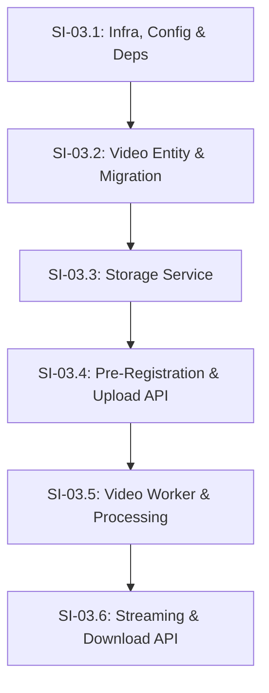

# Phase 03 — Upload e Processamento de Vídeos

## Objective

Implement a high-performance, resilient, and secure infrastructure for uploading, processing, and streaming video files up to 10GB. This phase establishes the core video capability by introducing object storage (MinIO), an asynchronous task worker (FFmpeg-enabled), message queues (BullMQ/Redis), multipart presigned uploads, HTTP range-request streaming, and NanoID-based unique public URLs.

---

## Step Implementations

### SI-03.1 — Infrastructure, Configuration, and Dependencies

**Description:** Install all necessary dependencies in `nestjs-project`, create configuration namespaces for storage (MinIO) and queue (Redis), validate environment variables, and update `compose.yaml` to include Redis and MinIO services.

**Technical actions:**
- Install production dependencies in `nestjs-project`:
  - Queue: `@nestjs/bullmq@^3.1.0`, `bullmq@^5.30.0`
  - Storage: `@aws-sdk/client-s3@^3.1085.0`, `@aws-sdk/s3-request-presigner@^3.1085.0`
  - Processing: `fluent-ffmpeg@^2.1.3`
  - Unique ID: `nanoid@^3.3.8`
- Install development dependencies:
  - `@types/fluent-ffmpeg@^2.1.x`
- Create `src/config/storage.config.ts` — `registerAs('storage', ...)` reading:
  - `STORAGE_ENDPOINT` (string, default `'http://minio:9000'`)
  - `STORAGE_ACCESS_KEY` (string, default `'minioadmin'`)
  - `STORAGE_SECRET_KEY` (string, default `'minioadmin'`)
  - `STORAGE_BUCKET_VIDEOS` (string, default `'videos'`)
  - `STORAGE_BUCKET_THUMBNAILS` (string, default `'thumbnails'`)
- Create `src/config/queue.config.ts` — `registerAs('queue', ...)` reading:
  - `REDIS_HOST` (string, default `'redis'`)
  - `REDIS_PORT` (number, default `6379`)
- Update `src/config/env.validation.ts` to add all new environment variables to the Joi validation schema.
- Update `.env.example` and the main `.env` with these new keys.
- Update `compose.yaml` in the root (or `nestjs-project/compose.yaml` if standalone) to add:
  - `redis` service (image `redis:7-alpine`, ports `6379:6379`)
  - `minio` service (image `minio/minio:RELEASE.2024-05-10T01-39-56Z`, command `server /data --console-address ":9001"`, ports `9000:9000`, `9001:9001`)
  - Add container auto-bucket creation script/container to bootstrap `videos` and `thumbnails` buckets on MinIO start.

**Dependencies:** None

**Acceptance criteria:**
- Application compiles and boots cleanly when new environment variables are validated.
- `docker compose up -d` boots `redis` and `minio` containers.
- MinIO console is accessible at `http://localhost:9001` and buckets `videos` and `thumbnails` are created.

---

### SI-03.2 — Video Entity and Database Schema

**Description:** Create the `Video` entity with a one-to-many relationship to `Channel`, specify columns for metadata and upload tracking, and generate the DB migration.

**Technical actions:**
- Create `src/videos/entities/video.entity.ts`:
  - `@Entity('videos')`
  - Fields:
    - `id` (uuid PK)
    - `title` (varchar(255), not null)
    - `description` (text, nullable)
    - `unique_url_id` (varchar(12), unique, indexed)
    - `status` (enum: `DRAFT`, `PROCESSING`, `READY`, `FAILED`, default `DRAFT`)
    - `failure_reason` (text, nullable)
    - `video_key` (varchar, nullable)
    - `thumbnail_key` (varchar, nullable)
    - `duration` (float, nullable)
    - `size_bytes` (bigint, nullable)
    - `mime_type` (varchar, nullable)
    - `channel_id` (uuid, FK → channels, not null)
    - `created_at` (CreateDateColumn)
    - `updated_at` (UpdateDateColumn)
  - Define `@ManyToOne(() => Channel, channel => channel.videos)` relation and map back to `Channel` entity.
- Generate migration `CreateVideos` using TypeORM CLI and verify SQL schemas.
- Register `Video` entity inside `VideosModule` database configuration.

**Tests:**
| File | Layer | Verifies |
|------|-------|----------|
| `src/videos/entities/video.entity.integration-spec.ts` | Integration | Unique NanoID constraint, status transition constraints, channel relation cascades |

**Dependencies:** SI-03.1

**Acceptance criteria:**
- Running `npm run migration:run` creates the `videos` table in PostgreSQL.
- Foreign keys and unique index on `unique_url_id` are verified.

---

### SI-03.3 — Object Storage Service

**Description:** Implement `StorageService` to interface with S3/MinIO for multipart uploads, downloading streams, and uploading thumbnail buffers.

**Technical actions:**
- Create `src/videos/services/storage.service.ts` injecting storage configuration.
- Implement the following methods:
  - `initializeMultipartUpload(bucket: string, key: string, contentType: string): Promise<string>`
  - `generatePresignedUploadPartUrl(bucket: string, key: string, uploadId: string, partNumber: number): Promise<string>`
  - `completeMultipartUpload(bucket: string, key: string, uploadId: string, parts: { ETag: string, PartNumber: number }[]): Promise<void>`
  - `abortMultipartUpload(bucket: string, key: string, uploadId: string): Promise<void>`
  - `getObjectStream(bucket: string, key: string, range?: string): Promise<{ stream: NodeJS.ReadableStream, contentLength: number, contentType: string, contentRange?: string }>`
  - `uploadBuffer(bucket: string, key: string, buffer: Buffer, contentType: string): Promise<void>`

**Tests:**
| File | Layer | Verifies |
|------|-------|----------|
| `src/videos/services/storage.service.integration-spec.ts` | Integration | Initializes, uploads parts, completes multipart uploads, and streams back from MinIO |

**Dependencies:** SI-03.2

**Acceptance criteria:**
- Integration tests pass against the live MinIO container.
- File chunks are uploaded directly and merged successfully by the S3 client.

---

### SI-03.4 — Video Pre-Registration & Multipart Upload API Endpoints

**Description:** Implement the REST API routes to pre-register a video, retrieve presigned upload URLs for parts, and complete the upload.

**Technical actions:**
- Create `VideosController` and `VideosService`.
- Implement `POST /videos/upload/initiate`:
  - Body: `InitiateUploadDto` containing `title`, `description`, `fileName`, `fileSizeBytes`, `mimeType`.
  - Action: Generate NanoID (12 characters, URL-safe), insert a new `Video` record in `DRAFT` status, initialize a multipart upload in MinIO, and return `videoId`, `uploadId`, and the target `key`.
- Implement `POST /videos/:id/upload/part-url`:
  - Body: `GetPartUrlDto` containing `uploadId`, `partNumber`.
  - Action: Generate a presigned S3 URL for uploading the specified chunk index.
- Implement `POST /videos/:id/upload/complete`:
  - Body: `CompleteUploadDto` containing `uploadId`, `parts` (array of `{ ETag, PartNumber }`).
  - Action: Complete the multipart upload on MinIO, change video status to `PROCESSING`, and enqueue a `process-video` job into the BullMQ `video-processing` queue.

**Tests:**
| File | Layer | Verifies |
|------|-------|----------|
| `src/videos/videos.controller.spec.ts` | Unit | Route routing, DTO validation, and parameter sanitization |
| `src/videos/videos.service.integration-spec.ts` | Integration | End-to-end upload orchestrations, DB drafts insertion, and queue job publication |
| `test/videos-upload.e2e-spec.ts` | E2E | Standard endpoints HTTP range status, auth gates, and payload validations |

**Dependencies:** SI-03.3

**Acceptance criteria:**
- Authenticated client can initiate upload, obtain signed URLs, and complete it.
- Video status in database is `PROCESSING` and a message is pushed to Redis queue.

---

### SI-03.5 — Video Processing Worker (FFmpeg and Queue Consumer)

**Description:** Configure a separate container/process for the video worker containing FFmpeg. Consume `process-video` jobs, extract video duration, capture a thumbnail frame, and update status in the database.

**Technical actions:**
- Update `compose.yaml` to add `video-worker` service running the same codebase but starting with `IS_WORKER=true` (which only initializes TypeORM, Storage, and the BullMQ Queue Consumer).
- Update the Dockerfile (or add a separate `Dockerfile.worker`) to install `ffmpeg` and `ffprobe` packages.
- Create `src/videos/processors/video.processor.ts` extending `WorkerHost`:
  - Listen to `video-processing` queue for `process-video` job.
  - Download/Stream the video file from MinIO to a temporary local workspace.
  - Use `fluent-ffmpeg` / `ffprobe` to extract duration.
  - Use `ffmpeg` to extract a frame at 10% mark (or 5 seconds) and save it as a JPEG.
  - Upload the generated JPEG to the `thumbnails` bucket on MinIO.
  - Update Video record in PostgreSQL: status = `READY`, populate `duration`, `video_key`, `thumbnail_key`.
  - Clean up local temporary files.
  - If processing fails, catch the error, update Video status to `FAILED` with `failure_reason`, and log diagnostics.

**Tests:**
| File | Layer | Verifies |
|------|-------|----------|
| `src/videos/processors/video.processor.integration-spec.ts` | Integration | Processor consumes job, runs FFmpeg commands on a fixture video, uploads thumbnails, and updates DB status |

**Dependencies:** SI-03.4

**Acceptance criteria:**
- The `video-worker` container starts up and registers with BullMQ.
- Completed uploads automatically trigger worker tasks which process videos and transition their status to `READY`.

---

### SI-03.6 — Video Streaming and Download API Endpoints

**Description:** Implement streaming endpoints supporting HTTP Range Requests (206 Partial Content) and video download functionality.

**Technical actions:**
- Implement `GET /videos/:id/stream`:
  - Public route. Resolve the video by its NanoID `unique_url_id`.
  - Read request `Range` header (e.g. `bytes=0-1048576`).
  - Request matching byte ranges from MinIO using `StorageService.getObjectStream`.
  - Return HTTP 206 Partial Content with headers: `Content-Range`, `Content-Length`, `Content-Type`, `Accept-Ranges: bytes`.
  - Support fallback HTTP 200 for full stream delivery.
- Implement `GET /videos/:id/download`:
  - Public route. Streams the full object from MinIO and sets header `Content-Disposition: attachment; filename="<original_title>.mp4"`.
- Implement `GET /videos/:id`:
  - Public route. Returns video details (title, description, status, duration, channel information, and unique ID).

**Tests:**
| File | Layer | Verifies |
|------|-------|----------|
| `test/videos-delivery.e2e-spec.ts` | E2E | Serves HTTP 206 with correct Range blocks, downloads full files, returns 404 for invalid NanoIDs |

**Dependencies:** SI-03.5

**Acceptance criteria:**
- Requesting `/videos/:id/stream` with `Range` header starts playback inside HTML5 video player immediately.
- Seeking in the video player works (correct 206 responses are served).
- Requesting `/videos/:id/download` downloads the file with the correct name.

---

## Technical Specifications

### Data Model

#### Entity `Video`
- `id`: `uuid`, Primary Key
- `title`: `varchar(255)`, Not Null
- `description`: `text`, Nullable
- `unique_url_id`: `varchar(12)`, Unique, Indexed, Not Null
- `status`: `enum` (`DRAFT`, `PROCESSING`, `READY`, `FAILED`), Default `DRAFT`
- `failure_reason`: `text`, Nullable
- `video_key`: `varchar`, Nullable
- `thumbnail_key`: `varchar`, Nullable
- `duration`: `float`, Nullable (seconds)
- `size_bytes`: `bigint`, Nullable
- `mime_type`: `varchar`, Nullable
- `channel_id`: `uuid`, Foreign Key referencing `channels(id)`
- `created_at`: `timestamp`, Default `now()`
- `updated_at`: `timestamp`, Default `now()`

Relation: `videos` belongs to `channels` (Many-to-One).

---

### API Contracts

#### 1. Initiate Multipart Upload
- **Method:** `POST`
- **Path:** `/videos/upload/initiate`
- **Headers:** `Authorization: Bearer <token>`
- **Request Body:**
  ```json
  {
    "title": "My Awesome Video",
    "description": "This is a video description.",
    "fileName": "awesome-video.mp4",
    "fileSizeBytes": 104857600,
    "mimeType": "video/mp4"
  }
  ```
- **Response 201:**
  ```json
  {
    "videoId": "uuid-string",
    "uploadId": "multipart-upload-id-from-s3",
    "key": "channel-uuid/video-uuid/awesome-video.mp4"
  }
  ```

#### 2. Get Presigned Part URL
- **Method:** `POST`
- **Path:** `/videos/:id/upload/part-url`
- **Headers:** `Authorization: Bearer <token>`
- **Request Body:**
  ```json
  {
    "uploadId": "multipart-upload-id-from-s3",
    "partNumber": 1
  }
  ```
- **Response 201:**
  ```json
  {
    "url": "https://minio:9000/videos/...with-signature..."
  }
  ```

#### 3. Complete Multipart Upload
- **Method:** `POST`
- **Path:** `/videos/:id/upload/complete`
- **Headers:** `Authorization: Bearer <token>`
- **Request Body:**
  ```json
  {
    "uploadId": "multipart-upload-id-from-s3",
    "parts": [
      { "ETag": "\"etag-value-1\"", "PartNumber": 1 },
      { "ETag": "\"etag-value-2\"", "PartNumber": 2 }
    ]
  }
  ```
- **Response 200:**
  ```json
  {
    "id": "video-uuid",
    "status": "PROCESSING"
  }
  ```

#### 4. Stream Video (Range Requests)
- **Method:** `GET`
- **Path:** `/videos/:unique_url_id/stream`
- **Headers:** `Range: bytes=0-1048576`
- **Response 206:**
  - **Headers:**
    - `Content-Range: bytes 0-1048576/104857600`
    - `Content-Length: 1048577`
    - `Content-Type: video/mp4`
    - `Accept-Ranges: bytes`
  - **Body:** Binary Stream chunk

#### 5. Download Video File
- **Method:** `GET`
- **Path:** `/videos/:unique_url_id/download`
- **Response 200:**
  - **Headers:**
    - `Content-Type: video/mp4`
    - `Content-Disposition: attachment; filename="awesome-video.mp4"`
  - **Body:** Binary Stream file

#### 6. Get Video Details
- **Method:** `GET`
- **Path:** `/videos/:unique_url_id`
- **Response 200:**
  ```json
  {
    "id": "video-uuid",
    "title": "My Awesome Video",
    "description": "This is a video description.",
    "uniqueUrlId": "unique-id",
    "status": "READY",
    "duration": 124.5,
    "sizeBytes": 104857600,
    "createdAt": "2026-07-11T12:00:00Z",
    "channel": {
      "id": "channel-uuid",
      "name": "My Channel",
      "nickname": "mychannel"
    }
  }
  ```

---

### Authorization Matrix

| Route | Method | Auth | Roles / Ownership |
|-------|--------|------|-------------------|
| `/videos/upload/initiate` | POST | Yes (JWT) | Authenticated user (creates under their channel) |
| `/videos/:id/upload/part-url` | POST | Yes (JWT) | Authenticated user (must own the channel of the video) |
| `/videos/:id/upload/complete` | POST | Yes (JWT) | Authenticated user (must own the channel of the video) |
| `/videos/:unique_url_id/stream` | GET | No | Public (anyone can play) |
| `/videos/:unique_url_id/download` | GET | No | Public (anyone can download) |
| `/videos/:unique_url_id` | GET | No | Public (anyone can view details) |

---

### Error Catalog

| Code | Status | Message | Description |
|------|--------|---------|-------------|
| `VIDEO_NOT_FOUND` | 404 | Video not found | Unique URL ID or UUID does not exist |
| `CHANNEL_NOT_FOUND` | 404 | User channel not found | Authenticated user does not have a channel to upload |
| `UNAUTHORIZED_CHANNEL_ACCESS` | 403 | You do not own this channel | User trying to upload/manage video in a channel they do not own |
| `INVALID_UPLOAD_ID` | 400 | Invalid upload ID | Provided upload ID is invalid or already closed |
| `UPLOAD_COMPLETION_FAILED` | 500 | Failed to complete multipart upload | Storage provider failed to merge parts |
| `VIDEO_PROCESSING_FAILED` | 500 | Video processing failed | FFmpeg failed to extract metadata/thumbnail |

---

### Events and Messages

#### BullMQ Queue: `video-processing`

- **Job Name:** `process-video`
- **Payload Schema:**
  ```json
  {
    "videoId": "uuid-string",
    "videoKey": "string (S3 object key)"
  }
  ```
- **Job Configuration:**
  - Attempts: 3
  - Backoff: Exponential (5000ms delay)
  - Remove on complete: true
  - Remove on fail: false (keep for audit/debugging)

---

## Dependency Map



---

## Deliverables

- **D-03.1:** Object storage, redis, and worker containers running in Docker Compose (`compose.yaml`).
- **D-03.2:** Database migration creating `videos` table and mapping relationships.
- **D-03.3:** SIs implemented and verified by automated unit, integration, and E2E tests.
- **D-03.4:** Large uploads (up to 10GB) functional via multipart direct URLs.
- **D-03.5:** Worker automatically extracting metadata (duration) and thumbnails via FFmpeg.
- **D-03.6:** HTTP Range Request streaming and download endpoints fully working.
